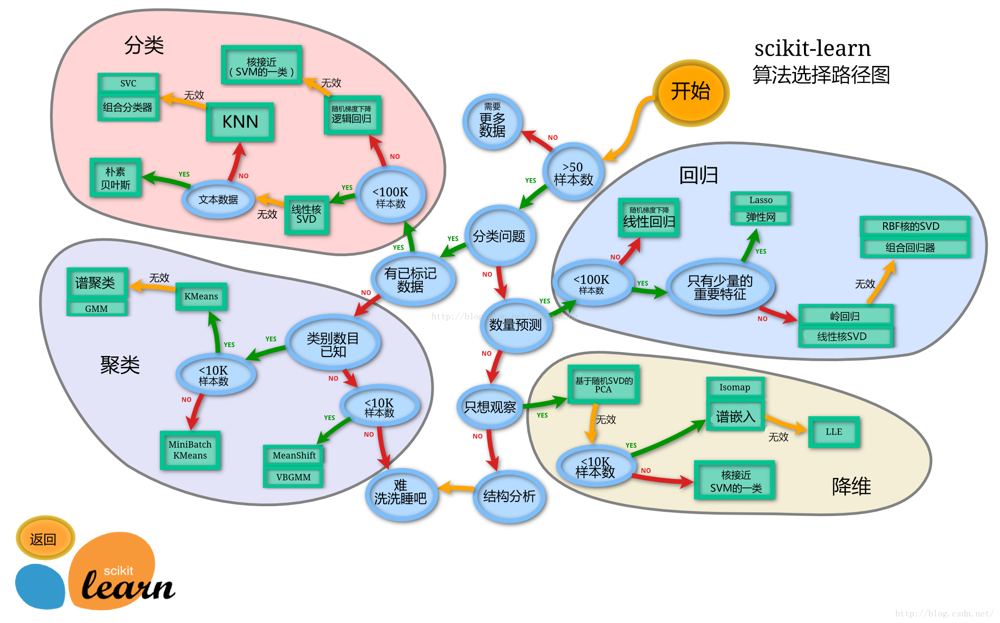

<head>
    
    
</head>

# 2022/2月的文章集合

## 测试文章001
  这是一篇测试的文章，包含一些公式
 - 激活函数 (Activation Function)
  - 当下神经元使用 sigmoid 激活函数： $ f(z) = \frac{1}{1+e^{-z}} $
  - 导数为: $ f'(x) = f(x)(1-f(x)) $
      $$ f'(x) = (\frac{1}{1+e^{-x}})' $$ 
      $$ = \frac{e^{-x}}{(1+e^{-x})^2} $$
      $$ = \frac{1 + e^{-x} - 1}{(1+e^{-x})^2} $$
      $$ = \frac{1}{(1+e^{-x})}(1-\frac{1}{(1+e^{-x})}) $$
      $$ f'(x) = f(x)(1-f(x)) $$
- 损失函数 (Loss Function)
  - 当下网络使用 均方差 ( 见函数: calculate_total_error )

## 测试文章 002
 这里计划放一些图片看看效果
 
 
